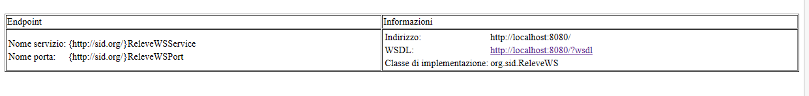
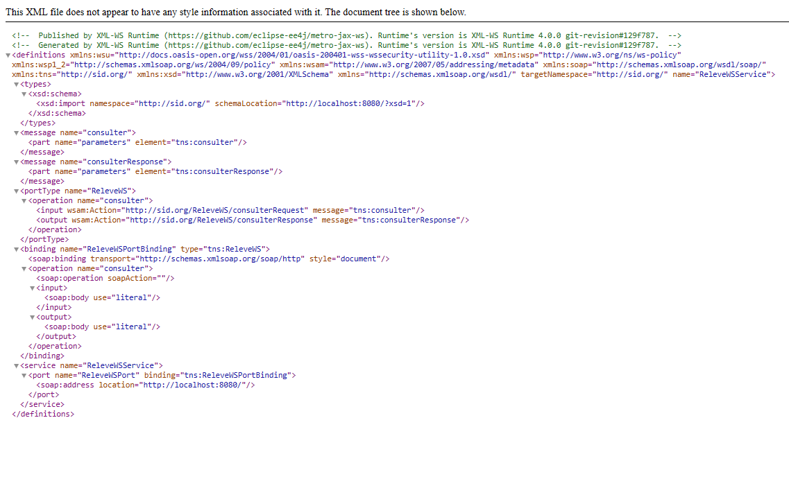
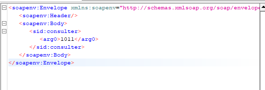
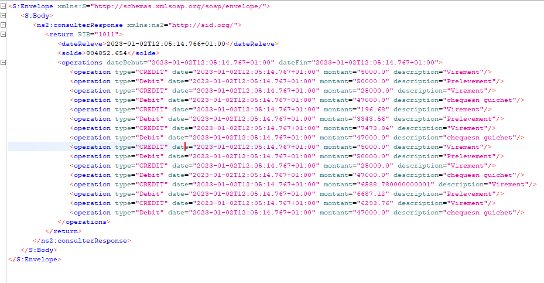

<html lang="en">
<head>
</head>
<body>
    <h1>Response Serveur </h1>
    
    <h1>Analyse du WSDL a partire du serveur</h1>
    

<h1>Request SOAP a travers SOAPUI</h1>

<h1>Response SOAP a travers SOAPUI</h1>

</body>
</html>